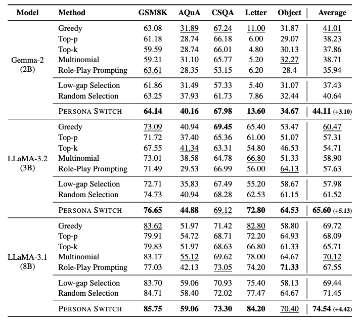

# PERSONA SWITCH: Mixing Distinct Perspectives in Decoding Time

This is the official code for our paper "[Persona Switch: Mixing Distinct Perspectives in Decoding Time](https://arxiv.org/)".

## 🔥 Quick Start

1. add your own `HF_TOKEN` inside `.env`
2. uncomment the hyperparameters before you run the shell script.
+ `run_single_prompting.sh`: execute zero-shot prompting and role-play prompting
+ `run_other_decoding_strategy`: run baselines
+ `run_persona_switch`: run persona switch

## Evaluation Result



## Citation

Updating Soon!
<!-- ```
@misc{kim2026persona,
  title={Persona is a double-edged sword: Mitigating the negative impact of role-playing prompts in zero-shot reasoning tasks},
  author={Kim, Junseok and Yang, Nakyeong and Jung, Kyomin},
  eprint={2408.08631},
  year={2024},
  archivePrefix={arXiv},
  primaryClass={cs.CL}
}
``` -->